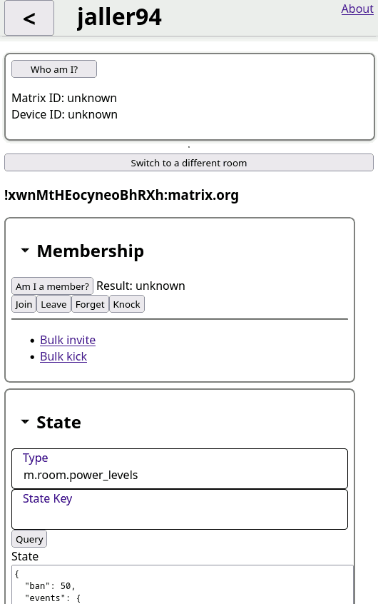

# Matrix Wrench
A small, static webapp for viewing and modifying room states.

Maturity: Alpha

## Project goals
* Replace `curl` as the best tool for Matrix operations tasks.
* Make it easy to mutate rooms and their states.
* No unintentional API calls.
* Design for both mobile and (touch) desktop devices.
* Feature exceptional accessibility for users using a keyboard and screen readers.
* Static webapp (cacheable, no backend needed)
* [Keep it small and simple](https://en.wikipedia.org/wiki/KISS_principle)
  * Minimal dependencies
  * 100 kb gziped bundle limit

## Roadmap
* Hire someone for UI/Layout design (idea)
* Improve API call history (idea)
* Dry-run mode (idea)
* Validation of state events before sending them (idea)
* Perform bulk actions in rooms (idea)
